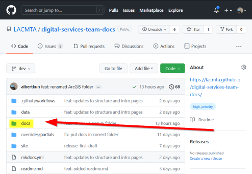

# Quick Start - Basic

Here is the link to the slides for the [workshop](/media/workshop9_10_21.pdf).

To begin, visit the GitHub repository for the documentation here:

 - [https://github.com/LACMTA/digital-services-team-docs/](https://github.com/LACMTA/digital-services-team-docs/tree/dev){target=_blank}

Most changes should be made onto the `dev` branch or your own branch.

!!! note
    If you do not have access to the repository, you can request access from [Albert][albert-kochaphum] or [Nina][nina-kin]. Otherwise you will end up forking the repository and will need to make a [pull request](https://docs.github.com/en/github/collaborating-with-pull-requests/proposing-changes-to-your-work-with-pull-requests/about-pull-requests) from your own repository. Learn more about forking here:
    https://guides.github.com/activities/forking/.

## Requirements

- [Have a GitHub account](https://github.com/){target=_blank}

## Adding new pages

Categorize your information as one of the following:

- **Process** - Anything with defined goals, deliverables, or timelines
- **Project** - Any organizational method or process
- **Software** - Internal and external software and resources

Find a suitable location for your new page within the `docs` folder on the [GitHub Documentation repository](https://github.com/LACMTA/digital-services-team-docs/){target=_blank}.

If your source documentation is stil a work-in-progress as a document on another platform (e.g. Google Docs, Dropbox Paper), find or create a relevant page and add a link to the source file.

If your source documentation is complete, import the content.

### Importing a File

`.docx` files from Google Docs, Dropbox Paper, or Microsoft Word, can be exported into the `.md` Markdown format and then imported into the documentation site.

1. Go to the [Digital Services Team Docs](https://github.com/LACMTA/digital-services-team-docs.git){target=_blank} repository on GitHub.

2. Click on the `docs` folder and navigate to the folder you want to put your file.

3. Click the `Add File` dropdown, select `Upload files`, and select your `.md` file.

### Creating a File on GitHub

You can use the GitHub interface to create a new file and add content through the web editor.

1. Go to the [Digital Services Team Docs](https://github.com/LACMTA/digital-services-team-docs.git){target=_blank} repository on GitHub.

2. Click on the `docs` folder and navigate to the folder you want to create a file in.

3. Click the `Add File` dropdown and select `Create new file`.

4. The editor will appear in the page:

    

5. Give your new file a name (make sure it it ends in `.md`) and use the editor to enter the content.

6. Save by clicking the green button that will appear as `Propose changes` or `Commit changes`.

## Editing a page in GitHub

Using [Markdown](https://guides.github.com/features/mastering-markdown/#what){target=_blank}, you can use the GitHub interface to edit an existing page the web editor.

1. Go to the [Digital Services Team Docs](https://github.com/LACMTA/digital-services-team-docs.git){target=_blank} repository on GitHub.

2. Click on the `docs` folder and navigate to the file you want to update.

3. Click the pencil icon in the upper right corner of the document to edit the file:

    

4. The editor will appear in the page:

    

5. Save by clicking the green button that will appear as `Propose changes` or `Commit changes`.

Now is a good time to review the [contribution guidelines](quick-start-advanced.md).

If you are feeling adventurous, check out the [advanced quick start guide][quick-start-advanced] on the following page.
